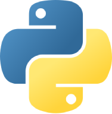

# SEA-India's Python Learning Support Group (PLSG)
{ align=left }

This is the home page of the Structural Engineers' Associtaion's **Python Learning Support Group (PLSG)**. It is a learning resource for the group engaged in learning Python for structural engineering applications.

The group was formed after the talk "Python for Structural Engineers" organized by the SEA-India on 2026-01-20. You can see the presentation slides [here](/assets/python_for_structural_engineers.pdf).

The primary goal of this group is to offer support to the self-driven learning effort of its members through online sessions and sharing learning resources.

*[PLSG]: Python Learning Support Group
*[SEA-India]: Structural Engineers' Association-India