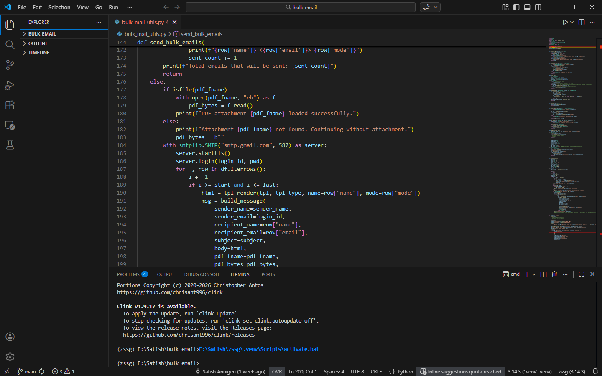

# Using a Code Editor

You need a text editor to write Python source code. Once written, you need to execute the code and if the output is incorrect you will have to debug and modify the code. In addition, you may have to choose the virtual environment that you wish to use. While all of this can be done by switching between the text editor of your choice and the Command Prompt, this can be simplified by using a code editor that lets you do all these within the same program. In addition, a good code editor will colour code the syntax, help warn you when you use incorrect type when using type hints.

Here is a list of popular code editors you can try:

1. [VS Code](https://code.visualstudio.com/download) or [VS Codium](https://vscodium.com/)
3. [spyder](https://www.spyder-ide.org/) has a GUI similar to that of Matlab
2. [SublimeText 4](https://www.sublimetext.com/) is not FOSS but is free to use
4. [PyCharm Community Edition](https://www.jetbrains.com/pycharm/) is not FOSS but is free to use

## VS Code
There are several code editors popular with Python developers, but we will use [VS Code](https://code.visualstudio.com/Download). Download and install VS Code and install the  *Microsoft Python* extension. This extension enable syntax highlighting, type hints, autocompletion, selection of a virtual environment and many more features.

<figure markdown="span">
  
<figcaption>VS Code code editor</figcaption>
</figure>

These are the important features of the VS Code GUI:

1. **Vertical toolbar** to the left has the following icons:
    * **Explorer** which shows the list of files in the folder
    * **Search** displays the search dialog to search files open in the editor window
    * **Source Control** helps you work with version control of the code. It can understand Git repositories and allows the programmer to carry out all tasks such as stage, commit, push, pull, clone etc
    * **Run and Debug** allows the programmer to run and debug code
    * **Extensions** allows the programmer to manage extensions, such as, installing, updating and deleting extensions
    * **Remote Explorer** allows the programmer to work with code on remote servers
    * **Test** allows the programmer to run tests if tests have been configured correctly
2. **Primary Sidebar:** Collapsible window to the right of the toolbar whose contents depend on which icon in the toolbar is selected
3. The multi-document tabbed **editor window**
4. **Secondary Sidebar** to the right
5. **Panel** at the bottom which can be toggled on or off. The panel contains the following:
    * **PROBLEMS** panel displays the warnings and errors in your code
    * **OUTPUT** panel shows the output of the commands executed
    * DEBUG CONSOLE is used when debugging the code
    * **TERMINAL** is used to type commands (it is a copy of the Command Prompt that is available in Windows)
    * **PORTS** displays the list of operating system ports being used by the programs running inside VS Code
  6. **Main Menu** at the top
  7. **Status Bar** at the bottom displays useful informatin about the current status of the editor, such as, the line and column position of the cursor, number of spaces inserted when you press the ++tab++ key, type of the current file and the virtual environment activated currently.
  
  Clicking the icons of the toolbar toggles the visibility of the Primary Sidebar.

  VS Code is highly configurable. See **File -> Preferences** to configure VS Code.The large number of Extensions available make VS Code highly customizable.
  