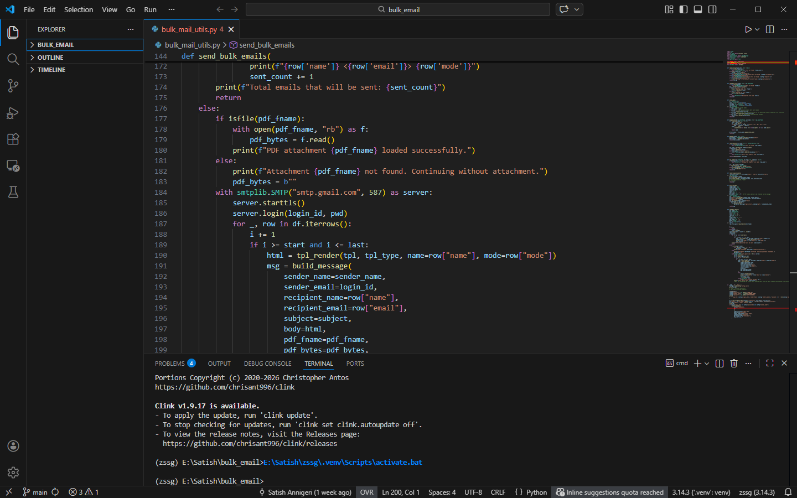

# Using a Code Editor

You need a text editor to write Python source code. Once written, you need to execute the code, and if the output is incorrect you will have to debug and modify it. In addition, you may need to select the virtual environment you wish to use. While all of this can be done by switching between a text editor and the Command Prompt, the process is simplified by using a code editor that lets you do everything within the same program. A good code editor will also provide syntax highlighting and warn you of type errors when using type hints.

Here is a list of popular code editors you can try:

1. [VS Code](https://code.visualstudio.com/download) or [VS Codium](https://vscodium.com/)
2. [Spyder](https://www.spyder-ide.org/) has a GUI similar to that of MATLAB
3. [SublimeText 4](https://www.sublimetext.com/) is not FOSS but is free to use
4. [PyCharm Community Edition](https://www.jetbrains.com/pycharm/) is not FOSS but is free to use

## VS Code
There are several code editors popular with Python developers, but we will use [VS Code](https://code.visualstudio.com/Download). Download and install VS Code and install the *Microsoft Python* extension. This extension enables syntax highlighting, type hints, autocompletion, selection of a virtual environment and many more features.

<figure markdown="span">
  
<figcaption>VS Code code editor</figcaption>
</figure>

These are the important features of the VS Code GUI:

1. **Vertical toolbar** to the left has the following icons:
    * **Explorer** shows the list of files in the current folder
    * **Search** displays the search dialog to search across files open in the editor
    * **Source Control** helps you manage version control. It understands Git repositories and allows you to stage, commit, push, pull, clone and more
    * **Run and Debug** allows you to run and debug your code
    * **Extensions** allows you to manage extensions, including installing, updating and removing them
    * **Remote Explorer** allows you to work with code on remote servers
    * **Test** allows you to run tests if they have been configured correctly
2. **Primary Sidebar:** A collapsible panel to the right of the toolbar whose contents depend on which toolbar icon is selected
3. The multi-document tabbed **editor window**
4. **Secondary Sidebar** to the right
5. **Panel** at the bottom, which can be toggled on or off. The panel contains the following:
    * **PROBLEMS** displays warnings and errors in your code
    * **OUTPUT** shows the output of commands executed
    * **DEBUG CONSOLE** is used when debugging code
    * **TERMINAL** is a command prompt built into VS Code
    * **PORTS** displays the list of operating system ports being used by programs running inside VS Code
6. **Main Menu** at the top
7. **Status Bar** at the bottom displays useful information about the current state of the editor, such as the line and column position of the cursor, the number of spaces inserted when you press the ++tab++ key, the type of the current file and the currently activated virtual environment.

Clicking a toolbar icon toggles the visibility of the Primary Sidebar.

VS Code is highly configurable. See **File → Preferences** to configure VS Code. The large number of available extensions makes it highly customisable.
