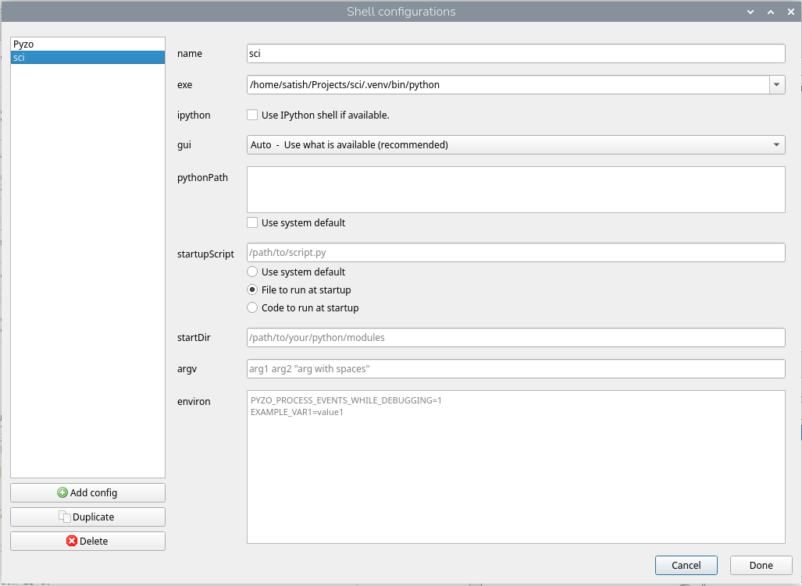

# Code Editors

You need a text editor to write Python source code. Once written, you need to execute the code, and if the output is incorrect you will have to debug and modify it. In addition, you may need to select the virtual environment you wish to use. While all of this can be done by switching between a text editor and the Command Prompt, the process is simplified by using a code editor that lets you do everything within the same program. A good code editor will also provide syntax highlighting and warn you of type errors when using type hints.

Here is a list of popular code editors you can try:

1. [VS Code](https://code.visualstudio.com/download) or [VS Codium](https://vscodium.com/)
2. [Spyder](https://www.spyder-ide.org/) has a GUI similar to that of MATLAB
3. [Pyzo](https://pyzo.org/) is similar to Spyder IDE but very lightweight. Ha a built-in Python REPL instead of IPython.
4. [SublimeText 4](https://www.sublimetext.com/) is not FOSS but is free to use
5. [PyCharm Community Edition](https://www.jetbrains.com/pycharm/) is not FOSS but is free to use

## VS Code
There are several code editors popular with Python developers, but we will use [VS Code](https://code.visualstudio.com/Download). Download and install VS Code and install the *Microsoft Python* extension. This extension enables syntax highlighting, type hints, autocompletion, selection of a virtual environment and many more features.

<figure markdown="span">
  
<figcaption>VS Code code editor</figcaption>
</figure>

These are the important features of the VS Code GUI:

1. **Vertical toolbar** to the left has the following icons:
    * **Explorer** shows the list of files in the current folder
    * **Search** displays the search dialog to search across files open in the editor
    * **Source Control** helps you manage version control. It understands Git repositories and allows you to stage, commit, push, pull, clone and more
    * **Run and Debug** allows you to run and debug your code
    * **Extensions** allows you to manage extensions, including installing, updating and removing them
    * **Remote Explorer** allows you to work with code on remote servers
    * **Test** allows you to run tests if they have been configured correctly
2. **Primary Sidebar:** A collapsible panel to the right of the toolbar whose contents depend on which toolbar icon is selected
3. The multi-document tabbed **editor window**
4. **Secondary Sidebar** to the right
5. **Panel** at the bottom, which can be toggled on or off. The panel contains the following:
    * **PROBLEMS** displays warnings and errors in your code
    * **OUTPUT** shows the output of commands executed
    * **DEBUG CONSOLE** is used when debugging code
    * **TERMINAL** is a command prompt built into VS Code
    * **PORTS** displays the list of operating system ports being used by programs running inside VS Code
6. **Main Menu** at the top
7. **Status Bar** at the bottom displays useful information about the current state of the editor, such as the line and column position of the cursor, the number of spaces inserted when you press the ++tab++ key, the type of the current file and the currently activated virtual environment.

Clicking a toolbar icon toggles the visibility of the Primary Sidebar.

VS Code is highly configurable. See **File → Preferences** to configure VS Code. The large number of available extensions makes it highly customisable.

## Spyder IDE

Spyder IDE is similar to the Matlab GUI. It offers a code editor, a Python console (an IPython console to be mpre accurate), a variable explorer and online help documentation. When you execute code in Spyder IDE, you can examine the status of the execution interactively, like you can in the Python console. Thus it offers the advantages of a code editor combined with a Python interpreter whereas VS Code offers the advantages of a code editor combined with the terminal (Command Prompt) along with Git and a host of other features. It is possible to include a Python console inside VS Code but that is not the most common use case for VS Code.

Some things to know about using the right Python interpreter if you have multiple virtual environments on your machine:

1. Check Tools -> Preferences -> Python interpreter setting. To use a specific Python interpreter, select **Selected interpreter** and set the path to the preferred virtual environment.
2. Create a Spyder Project by selecting the project folder in Projects -> Open project, and set the Python interpreter to be used by that project.
3. Ensure that the package `spyder-kernels` is installed in the virtual environment corresponding to the Python interpreter being used. Without this package, the IPython console will not open.
4. Open new console using Consoles -> New console in environment, and choose the correct environment.

## Pyzo

[Pyzo](https://pyzo.org/) is a free and open source computing environment for Python. It has a built-in Python REPL for interactive computing but does not have aterminal shell. It has features similar to Spyder IDE but is very lightweight and lods up and respond quickly. It can be configured to use a specific virtual environment and the environment must be activated manually each time the application is started. As fas as I can see, it does not associate a project with a chosen virtual environment and activate it when the project is opened. While lacking the bells and whistles, it is more than adequate for any task other than development of complex multifile packages.

It offers a downloadable install file for Windows, GNU/Linux and macOS. After install, configure Pyzo Shell.

1. The Shell can be configured from the **Shell -> Edit shell configurations...** dialog.
2. Click on the **Add config** button on the bottom of the left side panel to create a new Shell configuration.
3. Choose an easily identifiable **name** for this Shell configuration on the right side. Naming it the same as the directory name where the project files are stored is a good way to select a name.
4. Select the python executable from the virtual environment for the chosen project in the **exe** text field on the right side. This example is for a GNU/Linux system. The typical path for Windows would look like `C:\Users\<username>\<project_name>\.venv\Scripts\python.exe`.
5. Open the apllication from within the project directory and activate the Shell configuration from the list of available configurations from the **Shell** main menu item and click on the previously configured Shell for the project.
6. The Shell configuration can be edited from the **Shell -> Edit shell configurations...** dialog.

