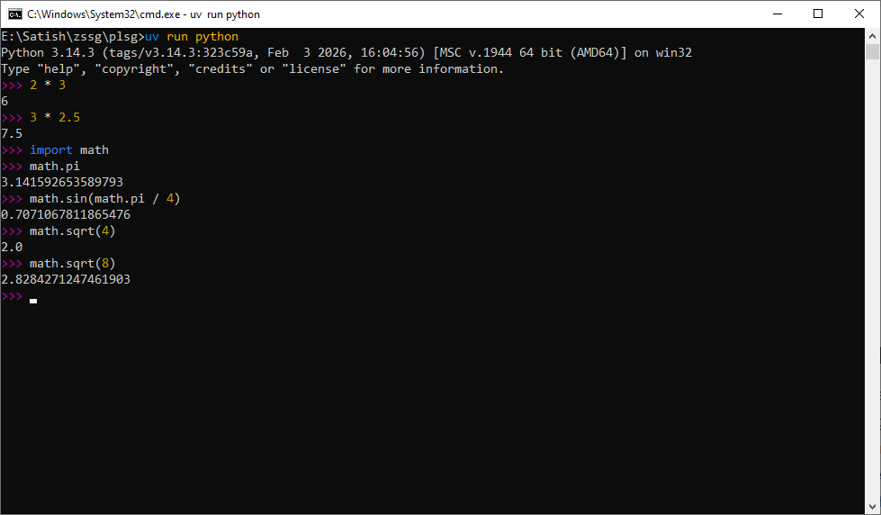
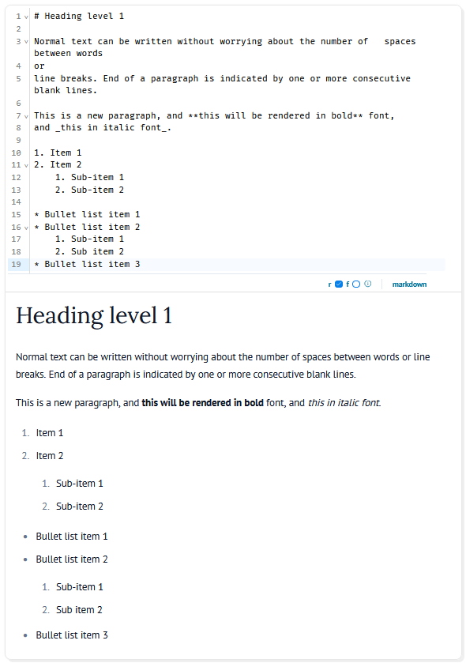

# Working with Python

There are several ways to work with Python.

## Python REPL (Read, Evaluate and Print Loop)

The Python REPL is the interactive Python interpreter shell. If executed without specifying a filename, the REPL opens as an interactive shell and you can begin to type Python code and press ++enter++ to execute the code. This is the easiest way to start learning Python. However, since it can work with only one or at most a few lines of code, it becomes difficult to write large programs. But if you are new to Python, it is the best way to get familiar with the language.

To exit the Python REPL and return to the command line, press ++ctrl+z++ followed by ++enter++ on Windows (++ctrl+d++ on GNU/Linux and macOS).

``` pycon title="Python REPL"
>>> 2 + 3
5
>>> 2 * 3
6
>>> 3 * 2.5
7.5
>>> import math
>>> math.pi
3.141592653589793
>>> math.sin(math.pi / 4)
0.7071067811865476
>>> math.sqrt(4)
2.0
>>> math.sqrt(8)
2.8284271247461903
>>> _
```

<figure markdown="span">
  
<figcaption>Python REPL</figcaption>
</figure>

## Code Editors
Once you have a basic understanding of Python, it is best to switch to writing code using a code editor. Any text editor can be used to write Python code, save it to the filesystem and then invoke the Python interpreter to read and execute the Python file.

Write the following code and save it as `main.py`
``` py title="main.py"
print("Hello, world!")
```
You can run this script from the command line
``` bash
> run python main.py
Hello, world!
> _
```
The output of the script is displayed on the next line and you are back at the command prompt.

This cycle of writing, saving, executing, modifying code is made easier if you use a code editor such as VS Code. It has the terminal built-in into the editor and has a file explorer so that you can select a file for editing or alternately create new file, rename a file or delete a file all from within the code editor. Learn more about [code editors](ide.md).

## Web Notebooks/IDE

### JupyterLab and Jupyter notebooks

Web browser based code editor such as [JupyterLab](https://jupyter.org/) does away with the need to download and install a code editor before you can work with Python code. You can install the JupyterLab Python package and you can begin working with Python code. JupyterLab calls its individual files Jupyter Notebooks. A Jupyter Notebook can contain both Python code as well as documentation in a markup language called [Markdown](https://www.markdownguide.org/basic-syntax/). Thus you can bundle Python code, its output as well as documentation to understand code into a single file. You can then share it with anyone who has JupyterLab installed on their machine and they can execute the notebook and inspect your code, look at its output and read the documentation. Markdown being a simple language to learn and being capable of writing mathematical equations, a Jupyter notebook is a powerful tool, especially when you want to share code and documentation with others, such as in an academic or research environment.

A Jupyter notebook consists of cells. Each cell can be either:

1. A code cell in which you can type Python code and execute the lines in the cell and see the output below the cell, or
2. A Markdown cell where you can type Markdown code and execute the cell to render it as HTML

Here is an example of writing documentation in Markdown:

<figure markdown="span">
  
<figcaption>Markdown rendered to HTML in a marimo notebook</figcaption>
</figure>

Markdown can render math equations written in $\LaTeX$ markup language. Here are two examples:
``` latex title="LaTeX display math equation"
$$
\cos x=\sum_{k=0}^{\infty}\frac{(-1)^k}{(2k)!}x^{2k}
$$
```
is a display equation, enclosed by a pair of `$$`, and is rendered by itself on a separate line as follows

$$
\cos x=\sum_{k=0}^{\infty}\frac{(-1)^k}{(2k)!}x^{2k}
$$

Equations can also be written in-line by enclosing it between two `$` characters:
``` latex title="In-line LaTeX equation"
A quadratic equation can be written as $a x^2 + b x + c = 0$
```
and is rendered as: A quadratic equation can be written as $a x^2 + b x + c = 0$

Refer the [Markdown documentation](https://www.markdownguide.org/basic-syntax/) for details.

!!! note "Reactive notebooks"
    Executing code in a Jupyter notebook cell affects only that cell. If there are other cells in the notebook which depend on variables that changed, they remain unaffected. Therefore, interdependence of cells must be known to the programmer and she must execute those cells affected by the changes arising from executing a cell. Alternately, execute all the cells.

### marimo reactive notebooks

[marimo](https://marimo.io) is like a Jupyter notebook, but is **reactive**. That is, a marimo notebook automatically executes all cells that are affected by changes arising due to executing one cell. It is like a Microsoft Excel spreadsheet with formulae. Changing the value in a cell automatically recalculates all cells affected by the changed value.
