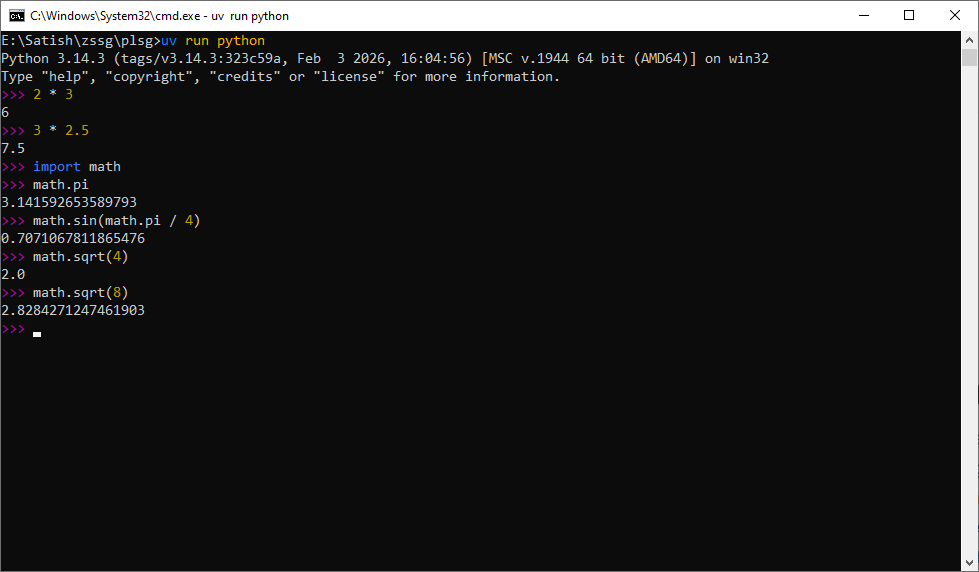
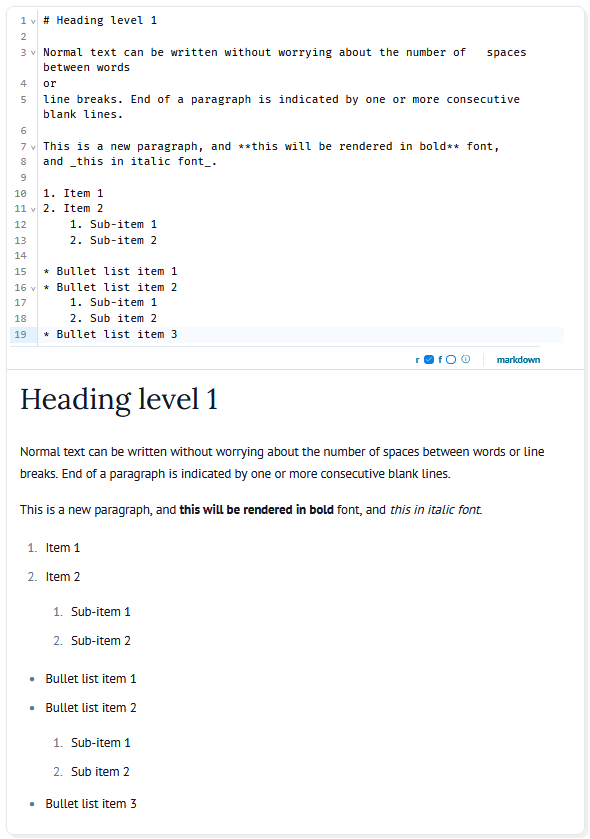

# Working with Python

There are several ways to work with Python.

## Python REPL (Read, Evaluate and Print Loop)

The Python REPL is the interactive Python interpreter shell. When started without specifying a filename, it opens as an interactive shell where you can type Python code and press ++enter++ to execute it. This is the easiest way to start learning Python. Since it works best with one or a few lines of code at a time, it is not well suited for writing larger programs — but if you are new to Python, it is an excellent way to get familiar with the language.

To exit the Python REPL and return to the command line, press ++ctrl+z++ followed by ++enter++ on Windows (++ctrl+d++ on GNU/Linux and macOS).
``` pycon title="Python REPL"
>>> 2 + 3
5
>>> 2 * 3
6
>>> 3 * 2.5
7.5
>>> import math
>>> math.pi
3.141592653589793
>>> math.sin(math.pi / 4)
0.7071067811865476
>>> math.sqrt(4)
2.0
>>> math.sqrt(8)
2.8284271247461903
>>> _
2.8284271247461903
```
!!! note
    In the Python REPL, the special variable `_` always holds the result of the last evaluated expression. In the example above, `_` would hold the value `2.8284271247461903`. This can be handy when you want to reuse the result of the previous expression without retyping it.

<figure markdown="span">
  
<figcaption>Python REPL</figcaption>
</figure>

## Code Editors
Once you have a basic understanding of Python, it is best to switch to writing code using a code editor. Any text editor can be used to write Python code, save it to the filesystem and then invoke the Python interpreter to execute it.

Write the following code and save it as `main.py`:
``` py title="main.py"
print("Hello, world!")
```
You can run this script from the command line:
``` bash
> python main.py
Hello, world!
> _
```
The output of the script is displayed on the next line and you are returned to the command prompt.

This cycle of writing, saving, executing and modifying code is made easier with a code editor such as VS Code, which has a built-in terminal and a file explorer that lets you open, create, rename and delete files without leaving the editor. Learn more about [code editors](ide.md).

## Web Notebooks/IDE

### JupyterLab and Jupyter notebooks

A web browser-based environment such as [JupyterLab](https://jupyter.org/) does away with the need to install a separate code editor. You simply install the JupyterLab Python package and you can begin working with Python straight away. JupyterLab calls its individual files Jupyter Notebooks. A Jupyter Notebook can contain both Python code and documentation written in a markup language called [Markdown](https://www.markdownguide.org/basic-syntax/). This lets you bundle code, its output and explanatory documentation into a single file. You can share it with anyone who has JupyterLab installed — they can execute the notebook, inspect the code, examine its output and read the documentation. Markdown is simple to learn and supports mathematical equations, making Jupyter notebooks a powerful tool for sharing code and documentation, particularly in academic or research settings.

A Jupyter notebook consists of cells. Each cell can be either:

1. A code cell, where you can type and execute Python code and see the output displayed below the cell, or
2. A Markdown cell, where you can type Markdown and execute the cell to render it as HTML.

Here is an example of writing documentation in Markdown:

<figure markdown="span">
  
<figcaption>Markdown rendered to HTML in a marimo notebook</figcaption>
</figure>

Markdown can render mathematical equations written in the $\LaTeX$ markup language. Here are two examples:
``` latex title="LaTeX display math equation"
$$
\cos x=\sum_{k=0}^{\infty}\frac{(-1)^k}{(2k)!}x^{2k}
$$
```
A display equation, enclosed by a pair of `$$`, is rendered on its own line as follows:

$$
\cos x=\sum_{k=0}^{\infty}\frac{(-1)^k}{(2k)!}x^{2k}
$$

Equations can also be written inline by enclosing them between two `$` characters:
``` latex title="In-line LaTeX equation"
A quadratic equation can be written as $a x^2 + b x + c = 0$
```
which is rendered as: A quadratic equation can be written as $a x^2 + b x + c = 0$

Refer to the [Markdown documentation](https://www.markdownguide.org/basic-syntax/) for further details.

!!! note "Reactive notebooks"
    Executing a cell in a Jupyter notebook affects only that cell. Other cells that depend on variables changed by that execution are not automatically updated. It is therefore the programmer's responsibility to know which cells are interdependent and to execute them accordingly — or to execute all cells at once.

### marimo reactive notebooks

[marimo](https://marimo.io) is similar to a Jupyter notebook, but is **reactive**. When one cell is executed, marimo automatically re-executes all cells affected by the resulting changes — much like a spreadsheet, where changing the value in one cell automatically recalculates all cells that depend on it.