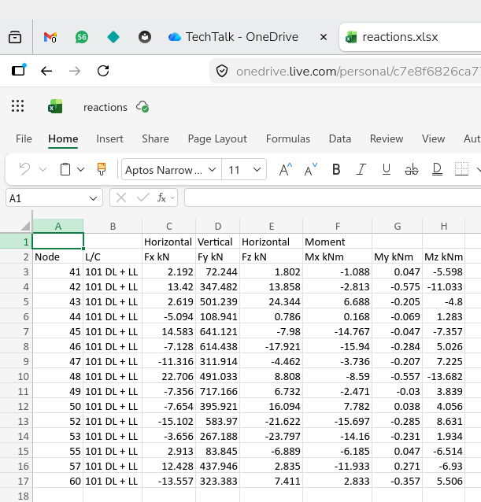

# Session 10: 16-05-2026 4:00 pm to 6:00 pm

## Agenda

1. Review of previous sessions
2. Answers to queries
3. `dataclasses.dataclass`
4. Filtering and grouping data with Pandas

## Object Oriented Programming (contd.)

The [`SearchDir` class](../sessions/session09/#implementation) created in Session 9 can be simplified using the `dataclass` decorator from the built-in [`dataclasses`](https://docs.python.org/3/library/dataclasses.html#module-dataclasses) module.

#### Simplify `class` definition - `dataclass` decorator

The primary purpose of `__init__()` is to initialize data into an instance, and is a good candidate for automation. That is the purpose of `dataclasses.dataclass` decorator. In addition to providing the `__init__()` method, the `dataclass` decorator provides the `__str__()` and several other dunder methods. The class definition reduces to the following:

```python title="searchdir.py" linenums="1"
from dataclasses import dataclass
from pathlib import Path


@dataclass
class SerachDir:
    path: str
    pattern: str
    recurse: bool = False

    def linecount(self, fname):
        with open(fname) as f:
            lines = f.readlines()
        return len(lines)

    def search_print(self):
        flist = self.path.rglob(self.pattern) if self.recurse else self.path.glob(self.pattern)
        flist = list(flist)
        if len(flist) == 0:
            print(f"No files matching {self.pattern} found")
            return

        total_lines = 0
        for i, f in enumerate(sorted(flist), 1):
            num_lines = self.linecount(f)
            total_lines += num_lines
            print(f"{f} ({num_lines})")
        print(f"Files: {i}, Total lines: {total_lines}")

if __name__ == "__main__":
    dir = SearchDir(Path("."), "*.py")
    print(dir, "\n")
    dir.search_print()
```

**Note**

1. All the data fields are listed along with their data type.
2. Data fields with default values must be listed toward the end. A data field without a default value cannot be listed after a data field having a default value (similar to function parameters).

#### Command Line Interfaces

Type the following code in a code editor (not in the Python REPL):
```python title="app.py" linenums="1"
import sys

print(sys.argv)
```

and run it from the command line:

=== "Using `uv`"
    ```doscon
    > uv run -- python app.py
    ['app.py']
    > uv run -- python app.py one, two three
    ['app.py', 'one', 'two', 'three']
    ```
=== "Using `pip` on Windows"
    ```doscon
    > .venv\Scripts\activate
    (.venv) > python app.py
    ```
=== "Using `pip` on GNU/Linux or macOS"
    ```doscon
    $ source .venv/bin/actiivate
    (.venv) $ python app.py
    ```

**Note**

1. [`sys`](https://docs.python.org/3/library/sys.html#module-sys) is a built-in module and gives access to several system information.
2. `sys.argv` returns a list of command line arguments typed at the command line when executing the application.
3. The first argument is the name of the application, in this case, `app.py`
4. All items in the `sys.argv` list are of type `str`. `sys.argv[0]` is always the name of the application itself.Arguments starting from index `1` can be treated as arguments to the application and interpreted as appropriate.

Let us use `sys.argv` and assume that the arguments have the following meaning:

1. `sys.argv[1]` represents the path to be searched, and is a required argument.
2. `sys.argv[2]` represents the filename pattern to be searched, and is a required argument.
3. `sys.argv[3]` represents whether to search the path recursively, and is an optional argument, defaulting to "false". User must type true to indicate the search to be recursive.

```python title="app.py" linenums="1"
import sys

def parse_args(argv):
    if len(argv) < 3:
        sys.exit("Usage: python app.py path pattern [false]")

    if (len(argv) > 3) and argv[3].lower() == 'true':
            recurse = True
    else:
        recurse = False

    return argv[1], argv[2], recurse


if __name__ == "__main__":
    print(sys.argv)
    path, pattern, recurse = parse_args(sys.argv)
    print(f"Path: {path}, Pattern: {pattern}, Recursive search: {recurse}")
```

**Note**

1. Filename pattern such as `*.py` must be enclosed within single or double quotes. Otherwise the command shell expands it to a list of filenames **before** calling the application.
2. The third argument is case-insensitive becaue we convert it to lowercase before checking its value.
3. Any value other than **true** is treated as **false** when evaluating the third command line argument.

Test this with different number of command line arguments:
```doscon
> uv run -- python app.py
Usage: python app.py path pattern [false]
> uv run -- python app.py .
Usage: python app.py path pattern [false]
> uv run -- python app.py . "*.py"
Path: ., Pattern: .py, Recursive search: False
> uv run -- python app.py . "*.py" true
Path: ., Pattern: .py, Recursive search: True
```

You can now integrate this with the program, but let us import the `SearchDir` object from `searchdir` module and modify `app.py` to provide command line argument parsing.

```python title="app.py" linenums="1" hl_lines="2 18 19"
import sys
from searchdir import SearchDir

def parse_args(argv):
    if len(argv) < 3:
        sys.exit("Usage: python app.py path pattern [false]")

    if (len(argv) > 3) and argv[3].lower() == 'true':
            recurse = True
    else:
        recurse = False

    return argv[1], argv[2], recurse


if __name__ == "__main__":
    path, pattern, recurse = parse_args(sys.argv)
    dir = SearchDir(path, pattern, recurse)
    dir.search_print()
```

Execute this application as follows:
```doscon
> uv run -- python app.py . "*.py"
app.py (22)
main.py (10)
searchdir.py (46)
vector.py (37)
vector2.py (41)
Files: 5, Total lines: 156
```

Python has several libraries for argument parsing, `argparse` being one of the oldest and very comprehensive but come with a learning curve. There are more recent and simpler packages such as **Typer** that simplify this process. The following code does the same as the previous version of the program. Study the [Typer documentation](https://typer.tiangolo.com/) to learn more, the code below is presented without any explanation.

Remember to install Typer with:
=== "Using `uv`"
    ```doscon
    > uv add typer
    ```
=== "Using `pip`"
    ```doscon
    > pip install typer
    ```

Let us rewrite `app.py` to use `typer` instead of the `parse_args()` function. Here is the code:

```python linenums="1" title="app.py"
import typer
from searchdir import SearchDir, main


if __name__ == "__main__":
    typer.run(main)
```
Execute the application from the command line:
```doscon
> uv run -- python app.py
                                                                                
 Usage: app.py [OPTIONS] PATH PATTERN                                           
                                                                                
╭─ Arguments ──────────────────────────────────────────────────────────────────╮
│ *    path         TEXT  [required]                                           │
│ *    pattern      TEXT  [required]                                           │
╰──────────────────────────────────────────────────────────────────────────────╯
╭─ Options ────────────────────────────────────────────────────────────────────╮
│ --recurse    --no-recurse      [default: no-recurse]                         │
│ --help                         Show this message and exit.                   │
╰──────────────────────────────────────────────────────────────────────────────╯
> uv run -- python app.py
Usage: app.py [OPTIONS] PATH PATTERN
Try 'app.py --help' for help.
╭─ Error ──────────────────────────────────────────────────────────────────────╮
│ Missing argument 'PATH'.                                                     │
╰──────────────────────────────────────────────────────────────────────────────╯
> uv run -- python app.py .
Usage: app.py [OPTIONS] PATH PATTERN
Try 'app.py --help' for help.
╭─ Error ──────────────────────────────────────────────────────────────────────╮
│ Missing argument 'PATTERN'.                                                  │
╰──────────────────────────────────────────────────────────────────────────────╯
> uv run -- python app.py . "*.py"
SearchDir(/home/satish/Python/sci, *.py, False) 

app.py (12)
app_v1.py (22)
main.py (10)
searchdir.py (46)
vector.py (37)
vector2.py (41)
Files: 6, Total lines: 168
> uv run -- python app.py . "*.py" --recurse
SearchDir(/home/satish/Python/sci, *.py, False) 

...
app.py (12)
app_v1.py (22)
main.py (10)
searchdir.py (46)
vector.py (37)
vector2.py (41)
Files: 1759, Total lines: 830435
```
!!! warning "Alert"
    Recursive listing lists the `.py` files in `.venv` and its subdirectories.

!!! tip "When do you need a `class`?"
    When you find yourself writing several functions, all of of which take the same set of data, it is time to stop and think:

    1. Do the frequently used set of data constitute attributes of some **thing**? If yes, that **thing** is a good candidate to be made into a `class`.
    2. The set of functions built around the attributes are good candidates to be made into **methods** of the class.

## Pandas (contd.)

Continuing to work with data from [**sales_data.csv**](../sessions/session09/#reading-data-from-files) file of Session 9


### Filtering Rows
```pycon linenums="1" hl_lines="1 13 18 23 24"

>>> df[["customer_name"]]     # Print data in column with the name "customer_name"
0    Alice Johnson
1        Bob Smith
2    Charlie Brown
3    Alice Johnson
4     David Miller
5              NaN
6      Frank White
7        Bob Smith
8        Grace Lee
9        Grace Lee
Name: customer_name, dtype: str
>>> df["customer_name"].unique()     # Print unique values from the column with the name "customer_name"
<ArrowStringArray>
['Alice Johnson',     'Bob Smith', 'Charlie Brown',  'David Miller',
             nan,   'Frank White',     'Grace Lee']
Length: 7, dtype: str
>>> df[df["category"] == "Electronics"]
   order_id  order_date  customer_name     category     product  quantity  unit_price region
0      1001  2023-01-15  Alice Johnson  Electronics  Headphones         1        50.0  North
2      1003  2023-01-17  Charlie Brown  Electronics   USB Cable         3        15.0  North
6      1007  2023-01-21    Frank White  Electronics  Smartphone         1       600.0  South
>>> df['total_sales'] = df['quantity'] * df['unit_price']
>>> df
   order_id  order_date  customer_name     category       product  quantity  unit_price region  total_sales
0      1001  2023-01-15  Alice Johnson  Electronics    Headphones         1        50.0  North         50.0
1      1002  2023-01-16      Bob Smith    Furniture  Office Chair         2       120.0  South        240.0
2      1003  2023-01-17  Charlie Brown  Electronics     USB Cable         3        15.0  North         45.0
3      1004  2023-01-18  Alice Johnson    Furniture     Desk Lamp         1        35.0  North         35.0
4      1005  2023-01-19   David Miller     Clothing       T-Shirt         5        20.0   East        100.0
5      1006  2023-01-20            NaN     Clothing        Hoodie         2        45.0   West         90.0
6      1007  2023-01-21    Frank White  Electronics    Smartphone         1       600.0  South        600.0
7      1008  2023-01-22      Bob Smith     Clothing       T-Shirt         3        20.0  South         60.0
8      1009  2023-01-23      Grace Lee    Furniture     Bookshelf         1       150.0   East        150.0
9      1010  2023-01-23      Grace Lee    Furniture     Bookshelf         1       150.0   East        150.0
```

**Note**

1. **Line 1:** Print the column with the name `customer_name`. Note the double square brackets, they are required when selecting more than one column but not required when selecting only one column.
2. **Line 13:** Print unique values in the column with the name `customer_name`.
3. **Line 18:** Filter the rows based on whether the value in the column `category` is `Electronics`.
4. **Line 23:** Create a new column named `total_sales` with the value of each row calculated by multiplying `quantity` by `unit_price`.

### Grouping Values

```pycon linenums="1" hl_lines="1 2"
>>> category_revenue = df.groupby('category')['total_sales'].sum()
>>> category_revenue
category
Clothing       250.0
Electronics    695.0
Furniture      575.0
Name: total_sales, dtype: float64
```

**Note**

1. A new DataFrame `category_revenue` is created by grouping the data by `cateory`.
2. Select the `total_sales` column.
3. Find the sum for each unique category.

### Handling Missing Values

Handling missing values is an important step in data cleaning. In the example data above, the value in column `customer_name` in row index `5` is missing. Depending on what is the objective of the cleaning operation one of several operations could be performed:

1. The entire row could be deleted.
2. The missing value coule be replaced with `Unknown` or some similar term.

The code below shows the second option:
```pycon linenums="1" hl_lines="1 5 12 13 20"
>>> print(df.isnull().sum()) # Shows how many empty cells are in each column
order_id         0
order_date       0
customer_name    1
category         0
product          0
quantity         0
unit_price       0
region           0
total_sales      0
dtype: int64
>>> df['customer_name'] = df['customer_name'].fillna('Unknown')
>>> df
   order_id  order_date  customer_name     category       product  quantity  unit_price region  total_sales
0      1001  2023-01-15  Alice Johnson  Electronics    Headphones         1        50.0  North         50.0
1      1002  2023-01-16      Bob Smith    Furniture  Office Chair         2       120.0  South        240.0
2      1003  2023-01-17  Charlie Brown  Electronics     USB Cable         3        15.0  North         45.0
3      1004  2023-01-18  Alice Johnson    Furniture     Desk Lamp         1        35.0  North         35.0
4      1005  2023-01-19   David Miller     Clothing       T-Shirt         5        20.0   East        100.0
5      1006  2023-01-20        Unknown     Clothing        Hoodie         2        45.0   West         90.0
6      1007  2023-01-21    Frank White  Electronics    Smartphone         1       600.0  South        600.0
7      1008  2023-01-22      Bob Smith     Clothing       T-Shirt         3        20.0  South         60.0
8      1009  2023-01-23      Grace Lee    Furniture     Bookshelf         1       150.0   East        150.0
9      1010  2023-01-23      Grace Lee    Furniture     Bookshelf         1       150.0   East        150.0
```
**Note**

1. **Line 1:** `df.isnull()` returns a DataFrame with the same shape as `df` but with values equal to `True` where the value in `df` is `Null` and `False` otherwise. The `sum()` of each column returns the sum of the values in the column considering `True` as `1` and `False` as `0`.
2. **Line 5:** Only one value is missing in the column `customer_name`.
3. **Line 12:** Select column `customer_name` and fill any missing values with the value `Unknown`.
4. **Line 20:** The missing value previously shown as `NaN` is now shown as `Unnown`.


### Example - Grouping of foundation reactions

The reactions from a STAAD.Pro analysis can be exported to Microsoft Excel format. This data can be read into a DataFrame and the data processed using Pandas. Here are the reactions when viewed in Microsoft Excel.



[Download reactions.xlsx](https://docs.google.com/spreadsheets/d/1tT5Z4DfhBoYobV-3HFxuSZt6tDj1xsoa/edit?usp=sharing&ouid=110646875011683705253&rtpof=true&sd=true)

**Note**

1. There are two header lines. By default, Pandas assumes the first row in the file to be column names.
2. The second line is treated as the first row of the DataFrame. To remedy this:  
    1. Store the first row (row index `0`) as column names,
    2. Clean the column names by removing `kN` and `kNm`,
    3. Discard the first row of the DataFrame, and 
    4. Rename the row numbers starting from `0`.
    5. Rename the columns from the stored values from first row.

For example:

1. Determine the minimum and maximum reactions.
2. Classify reactions into groups based on dividing the interval between maximum and minimum reactions into a specified number of equal class intervals.
3. Given the SBC, detemine the size of the isolated footing for the most severely loaded footing in each group.

!!! tip
    Install the `openpyxl` package if you want to read and write Microsoft Excel files.

    === "Using `uv`"
        ```doscon
        > uv add openpyxl
        ```

    === "Usin `pip`"
        ```doscon
        > pip install openpyxl
        ```

#### Code

Let us write two functions:

1. `read_staad_reactions(fname: str) -> pd.DataFrame` to read data from an `.xlsx` file, clean up the rows to assign column names, reset the row index and set the data type for the data in columns pertaining to reaction components.
2. `group_staad_reactions(df: pd.DataFrame, bins: int=5) -> pd.DataFrame` to group the data into bins and assign names to each group.
3. `main()` to set up the filename, call the first function to read and clean up the data and the second function to group the data. Finally, the grouped data is saved to a Microsoft Excel `.xlsx` file.

```python linenums="1"
from pathlib import Path

import numpy as np
import pandas as pd


def read_staad_reactions(fname: str) -> pd.DataFrame:
    df = pd.read_excel(fname)

    # Clean up the column names
    col_names = df.iloc[0]    # Current row index 0 should be the names of columns
    col_names = col_names.str.replace(" kNm", "")  # Replace kNm from column names
    col_names = col_names.str.replace(" kN", "")   # Replace kN from column names
    df = df.iloc[1:].reset_index(drop=True)  # Drop the first row, reindex remaining rows
    df.columns = col_names  # Set new column names using saved values

    # Set dtype of column names and selected columns
    df.columns = df.columns.map(str)  # Set dtype of column names to str
    cols = ["Fx", "Fy", "Fz", "Mx", "My", "Mz"]  # Select column names
    df[cols] = df[cols].astype("float64")  # Set dtype of selected columns to float64
    return df
```
**Note**

1. **Lines 11-15:** Clean up columns names
2. **Lines 18-20:** Set `dtype` of column names to `str` and of columns `Fx`, `Fy`, `Fz`, `Mx`, `My`, `Mz` to `float64`.
3. **Line 21:** Return the cleaned DataFrame.

```python linenums="22"
# Lines 1 to 21 not shown here
def group_staad_reactions(df: pd.DataFrame, bins: int=5) -> pd.DataFrame:
    df["Ecc_x"] = df["Mx"] / df["Fy"]  # Eccentricity
    df["Ecc_z"] = df["Mz"] / df["Fy"]  # Eccentricity

    custom_labels = [f"F{i:02}" for i in range(1, bins+1)]
    df['footing_type'] = pd.cut(df['Fy'], bins=bins, labels=custom_labels, include_lowest=True)
    df_sorted = df.sort_values(["footing_type", "Fy"])

    return df_sorted
```
**Note**

1. **Lines 24-25:** Calculate eccentricity in (metres) about `x` and `y` axes.
2. **Line 27:** Create a list with custom labels to be used for each bin.
3. **Line 28:** Create a new column `footing_type` and populate it with custom labels after cutting the range of values in column `Fy` into `10` equal sized bins. This new column is populated with the `custom_labels` based on the interval to which the value in `Fy` belongs. **Note:** The number of items in `custom_labels` must be equal to the number of bins.
4. **Line 29:** Sort the values on the DataFrame based on values in `footing_type` and additionally by `Fy` in case there are more than one row with the same value for `footing_type`.
5. **Line 31:** Return the grouped and sorted DataFrame.

We are now ready to write the `main()` function:
```python linenums="32"
# Lines 1-32 not shown
def main(fname: str):
    df = read_staad_reactions(fname)
    df = group_staad_reactions(df)
    print(df)

    # Set up output filename by adding _grouped to the input filename
    p = Path(fname)
    fout = p.with_stem(f"{p.stem}_grouped")

    # Save the cleaned, grouped, sorted DataFrame to .xlsx format
    df.to_excel(fout, index=False)
```

**Note**

1. **Line 34:** Call `group_staad_reactions()` to read the data, clean and set the column names, set the dtypes
2. **Line 35:** Split into `5` bins by splitting the range of values in column `Fy` and assign custom labels,
3. **Line 36:** Display the contents of the DataFrame.
4. **Line 38-40:** Set the name of the output file.
5. **Line 43:** Save the grouped, sorted DataFrame to output file.

We are now ready to set up the initial values and call `main()`:
```python linenums="40"
# Lines 1-40 not shown
if __name__ == "__main__":
    fname = "reactions.xlsx"
    main(fname)
```

**Note**

1. **Line 41:** Use `#!python if __name__ == "__main__"` to specify the lines to execute when the file is called directly as the `__main__` file and to ignore when the file is imported as a module.
2. **Line 42:** Set the input filename as `fname = reactions.xlsx`. If this application is converted to a CLI application, this can come from the command line argument.
3. **Line 43:** Invoke `main()` and execute the program if called directly.

### Recap

This session covered or mentioned several topics that are not the main topics of discussion. They are listed here as a reminder to study their documentation in detail for future use:

1. The online free book [Think Python, 3ed., Allen B. Downey]() is an excellent resource for beginners and experts alike. It is worthwhile digging deep into this book.
2. The [`pathlib`](https://docs.python.org/3/library/pathlib.html) built-in package is a comprehensive library for manipulating files paths, files and directories. It is extremely useful when automating tasks that use the file system.
3. The [`dataclasses`](https://docs.python.org/3/library/dataclasses.html#module-dataclasses) built-in module provides the `dataclass` decorator that simplifies implementing classes.
4. The [`sys`](https://docs.python.org/3/library/sys.html#module-sys) built-in module gives access the the system information.
5. The [`typer`](https://typer.tiangolo.com/) external package is an excellent tool to build CLI applications.
6. The [`pydantic`](https://pydantic.dev/docs/validation/latest/get-started/) package is a replacement for `dataclass` and is part of other packages such as [FastAPI](https://fastapi.tiangolo.com/) and [SQLModel](https://sqlmodel.tiangolo.com/) that you may find useful in the future.

The [Pandas](https://pandas.pydata.org/) package is gigantic and we have not even scratched the surface. Pandas has stiff competition from [Polars](https://pola.rs/) which is worth exploring. [Narwhals](https://narwhals-dev.github.io/narwhals/) may help you use either of them and quickly switch from one to the other without having to rewrite your code.
