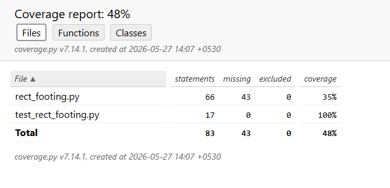
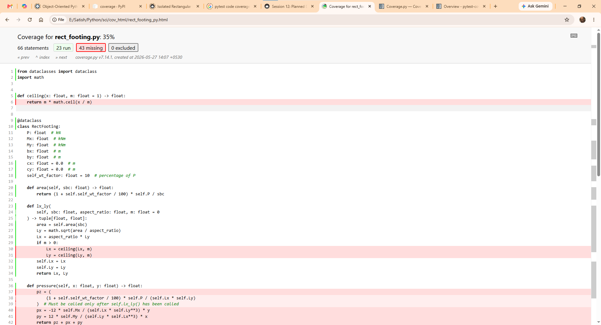

# Session 12: Planned Date 30-05-2026 4:00 pm to 6:00 pm

## Agenda

1. Review of previous sessions
2. Answers to queries
3. Code testing using `pytest`
4. Code coverage report using `pytest-cov`

Testing code is an integral part of software development and must not be an afterthought. While `print()` statements and debugging are constantly done during application development, that is not to be treated as testing. Testing must be:

1. Systematic and exhaustive. Every branch of a a logical statement and every possible input data must be tested.
2. Cover all lines of code and not just the most obvious cases.

Testing requires an ability to detatch oneself from the code they are developing and look at it critically. A thorough understanding o fthe problem domain must be known in order to craft all possible cases for testing. One must be able to write tests for the code that may have been written by others. Thus, one must be able to write exhaustive tests for the code written by themselves.

There are several tools that simplify the process of writinf tests and reorting the code covered by the tests so as to identify the code that has not been covered by the tests. This helps one to write additional tests to ensure coverage of entire code. Merely ensuring 100% code coverage does not assure thoroughnes of tests. With the domain knowledge, one must devise edge cases and ensure that the code behaves as expected under the most extreme cases.

## Code testing using `pytest`

[pytest](https://docs.pytest.org/en/stable/#) is a Python framework for functional testing of Python applications and libraries. It has the following features:

1. Auto-discovery of test modules and functions. Modules with names startng with `test_*.py` or `_test.py` are automatically considered as containing tests and functions within these modules with names starting with `test_` are assumed to be test functions. To test libraries, one can create a separate directory containing test modules and point `pytest` to this directory.
2. Testing is carried out using `assert` statements within the test functions.
3. Extendible with plugins. The plugin `pytest-cov` provides code coverage functionality to `pytest` using `coverage` module.

### Installing `pytest` and `pytest-cov`

Install `pytest` and `pytest-cov`with the following commands from the command line and test that it is installed correctly:

=== "Using `uv`"
    ```doscon
    > uv add pytest pytest-cov
    > uv run -- pytest --version
    pytest 9.0.3
    ```
=== "Using `pip` on Windows"
    ```doscon
    > .venv\Scripts\activate
    (.venv) > pip install pytest pytest-cov
    (.venv) > pytest --version
    pytest 9.0.3
    ```
=== "Using `pip` on GNU/Linux or macOS"
    ```doscon
    > .venv/bin/activate
    (.venv) > pip install pytest pytest-cov
    (.venv) > pytest --version
    pytest 9.0.3
    ```

### Writing tests
Tests are written in a Python module with its name starting with `test_*.py`. Functions within a test module are considered to be test functions if their name starts with `test_`. The test functions can be split between more than one test module if necessary.

We can take the code in the `if __name__ == "__main":` and convert them into tests, as shown below:

```py title="test_rect_footing.py" linenums="1"
from math import isclose

from rect_footing import RectFooting

f = RectFooting(P=150.0, Mx=0.0, My=0.0, bx=0.45, by=0.23)
sbc = 130.0


def test_area():
    area = 1.10 * 150.0 / sbc
    assert f.area(sbc) == area


def test_sides():
    Lx, Ly = f.lx_ly(sbc, aspect_ratio=1.0)
    assert isclose(Lx, Ly)
    assert isclose(Lx * Ly, f.area(sbc))

    Lx, Ly = f.lx_ly(sbc, aspect_ratio=1.5)
    assert isclose(Lx, 1.5 * Ly)
    assert isclose(Lx * Ly, f.area(sbc))

    Lx, Ly = f.lx_ly(sbc, aspect_ratio=0.75)
    assert isclose(Lx, 0.75 * Ly)
    assert isclose(Lx * Ly, f.area(sbc))
```

**Notes**

1. `isclose()` is imported from `math` in order to determine equality of floating point numbers which are sufficiently close.
2. `rect_footing` is imported as a module so that the class `RectFooting` is available to the testing module..
3. Any functions that may be required by the testing functions can be defined, but their names must not begin with `test_`, as otherwise they too will be considered as test functions.
4. It is best if each test function tests one aspect of the code. For example, `test_area()` tests whether the application calculates the required area correctly.
5. A single function can test multiple aspects for the same parameter. For example, `test_sides()` tests for different aspect ratios, equal to `1`, freaterthan `1` and less than `1`. However, edge cases have not been included, for example, aspect ratio of `0` should have been tested to see how the application behaves in that situation. An aspect ratio that is a negative number is also not tested.
6. The `assert` statement return `True` if an assertion succeeds and `False` if it fails. A test function is considered to have passed if all assertions in it pass.
7. To test if a calculation is correct, one technique is to calculate it from first principles within the module and compare it with the result from our code. However, care must be taken to ensure that the manual calculations are correct.
8. `isclose(x, y)` checks if the values `x` and `y` are sufficiently close to each other. See the documentation for [`math.isclose()`](https://docs.python.org/3/library/math.html#math.isclose) to learn how exactly the comparison is made.

### Running tests

Once the tests are written, we can run the tests as follows:

=== "Using `uv`"
    ```doscon
    > uv run -- pytest
    ```
=== "Using `pip` in Windows"
    ```doscon
    > .venv\Scripts\activate
    (.venv) > pytest
    ```
=== "Using `pip` in GNU/Linux/macOS"
    ```doscon
    > .venv/bin/activate
    (.venv) pytest
    ```

The output must look similar to the following:

```doscon
================================================= test session starts =================================================
platform win32 -- Python 3.14.3, pytest-9.0.3, pluggy-1.6.0
rootdir: E:\Satish\Python\sci
configfile: pyproject.toml
plugins: cov-7.1.0
collected 2 items

test_rect_footing.py ..                                                                                          [100%]

================================================== 2 passed in 0.22s ==================================================
```

If a test fails, detailed intermediate values will be displayed to help identify the failing test.

## Code coverage report using `pytest-cov`

When testing, it is important to ensure that all lines of code are tested by the test functions in the test modules. Trying to establish this manually can be difficult and time consuming. That is where the the [Coverage.py](https://coverage.readthedocs.io/en/7.14.1/) tool comes in handy. Even better, [`pytest-cov`] package is a `pytest` plugin that integrates `Coverage.py` into `pytest` instead of making it another additional task.

`pytest-cov` generates code coverage reports in HTML format and shows which lise of code have not been tested by the test modules. Studying this report helps in writing additional tests so that eventually, all lines of code are tested.

Code coverage report can be generated as follows:

=== "Using `uv`"
    ```doscon
    > uv run -- pytest --cov --cov-report=html:cov_html
    ```
=== "Using `pip` in Windows"
    ```doscon
    > .venv\Scripts\activate
    (.venv) > pytest --cov --cov-report=html:cov_html
    ```
=== "Using `pip` in GNU/Linux/macOS"
    ```doscon
    > .venv/bin/activate
    (.venv) > pytest --cov --cov-report=html:cov_html
    ```


**Note:** `cov_html` is the name of the directory where rthe HTML report is saved. This directory is created if it does not already exist, and if it exists, its contents will be replaced by the new report.

The output must look similar to the following:
```doscon
================================================= test session starts =================================================
platform win32 -- Python 3.14.3, pytest-9.0.3, pluggy-1.6.0
rootdir: E:\Satish\Python\sci
configfile: pyproject.toml
plugins: cov-7.1.0
collected 2 items

test_rect_footing.py ..                                                                                          [100%]

=================================================== tests coverage ====================================================
___________________________________ coverage: platform win32, python 3.14.3-final-0 ___________________________________

Coverage HTML written to dir cov_html
================================================== 2 passed in 0.51s ==================================================
```

**Note**

1. The tests are run as usual.
2. The coverage report is generated after the tests and the name of the directory wherethe report is saved is displayed.
3. The `index.htl` file in the report directory is the entry point to the report. Opening this file in a web browser shows the report, which must look similar to the following:



**Note**

1. It shows the percentage of the code that is covered by the tests, 48% in this case. It also shows the statistics in terms of files, functions and classes, by clicking on the respective tabs at the top of the report.
2. Clicking on the name of a file, for example, `test_rect_footing.py` in this case shown the file with the lines not covered by the tests with a red background.



### Remaining Tasks

#### Handling invalid input data

One important but frequently neglected aspect of application development is to foresee all types of expected input and to raise exceptions to handle invalid data.

For example, the method `def lx_ly(self, sbc: float, aspect_ratio: float, m: float = 0) -> tuple[float, float]` will fail under the following input values:

1. If `sbc` is a negative number, the calculation for area will result in a negative number.
2. If `aspect_ratio` is less than or equal to `0`, the calculations will fail.

A well written application will validate the input and raise appropriate exceptions when invalid data in encountered.

#### Source code comments

Comments are reminders for the programmer for the future when you revisit the source code after a long gap of time. It usually happens that as long as the application is giving results, we tend to ignore the source code. After a long gap of time, we tend to forgetthe intricacies in the code. When a bug crops up, and you revisitthe code, it is useful to have comments to remind oneself the claer intent of the code.

Comments are useful to other people who read your code. Since the code is new to them, the comments will clarify the intent of the programmer who wrotethe code.

#### Source code documentation

Python [PEP 8](https://peps.python.org/pep-0008/) is style guide for Python code. It describes the coding conventions for the Python code comprising the standard library in the main Python distribution.

[PEP 257](https://peps.python.org/pep-0257/) describes Docstring conventions. Docstrings are used by the Python REPL to generate help withn the REPL. Several linters available within code editors can use these Docstrings to generate autocomplete prompts.

[Google Doc Style](https://google.github.io/styleguide/pyguide.html#s3.8-comments-and-docstrings) is the convention for writing Docstrings in the source code that can be extracted by programs such as [Material for MkDocs](https://squidfunk.github.io/mkdocs-material/), [Zensical](https://zensical.org/) or [Sphinx](https://www.sphinx-doc.org/en/master/) to generate documentation for developers who wish to understand the code and modify the source code.

An alternative to the Google Doc Style is the [NumPy Doc Style](https://numpydoc.readthedocs.io/en/latest/format.html) followed by NumPy.

Sourc code documentation generators extract he Docstrings and generate documentation in HTML or other formats.