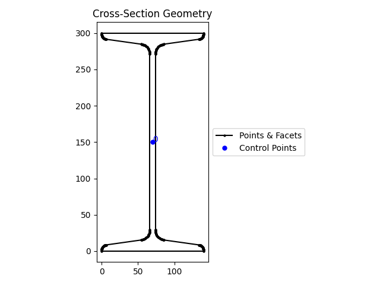
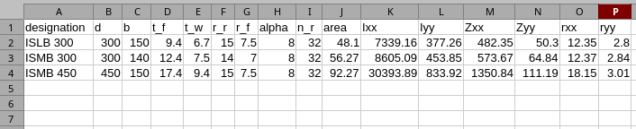

# Section Properties

[Task 6](../tasks/task20260415.md#task-for-non-structural-engineers) defined two problems, the first of which required the geometric properties of sections as per SP:6 (1)-1964.

It was suggested to use the [sectionproperties](https://sectionproperties.readthedocs.io/en/stable/index.html) package for the calculations. Let us do the following:

1. Install `sectionproperties` package from PyPI.
2. Study the documentation to create an I-section and calculate its geometric properties.
3. Try out the commands from Python REPL.
4. Develop a class to perform the specified tasks.
5. Develop a function to read data froma CSVV/Excel file and use the class to calculate geometric properties of sections listed therein.
6. Develop a CLI application to use the function.

## Install `sectionproperties`

=== "Using `uv`"
    ```doscon
    > uv add sectionproperties
    > uv run -- python -c "import sectionproperties"
    ```
    If no error is generated, the package is installed correctly.
=== "Using `pip` on Windows"  
    ```doscon
    > .venv\Scripts\activate
    (.venv) > pip install sectionproperties
    (.venv) > python -c "import sectionproperties"
    ```
    If no error is generated, the package is installed correctly.
=== "Using `pip` on GNU/Linux or macOS"  
    ```doscon
    > source .venv/bin/activate
    (.venv) > pip install sectionproperties
    (.venv) > python -c "import sectionproperties"
    ```
    If no error is generated, the package is installed correctly.

## Application Development

### `sectionproperties` Documentation

Exploring the [`sectionproperties` documentation](https://sectionproperties.readthedocs.io/en/stable/index.html) showed that the steps to calculating geometric properties of a section require the following steps:

1. Create a geometry.
2. Create a mesh for the geometry.
3. Create a section (`sectionproperties.analysis.Section`) from the geometry.
4. Calculate geometric propertiesof the section.
5. There is a pre-defined library of functions to create standard geometris and the one that is appropriate for steel cross sections as per SP:6 (1)-1964 are `tapered_flange_i_section()` for I sections and `tapered_flange-channel` for channel sections.

### Try sectionproperties in Python REPL

Open Python REPL or (IPython REPL inside Spyder IDE), note down the size of ISMB 300 from SP:6 (1)-1964  and try the following:

```pycon
>>> from sectionproperties.pre.library import tapered_flange_i_section
>>> from sectionproperties.analysis import Section
>>> geom = tapered_flange_i_section(d=300, b=140, t_f=12.4, t_w=7.5, r_r=14.0, r_f=7.0, alpha=8, n_r=16)
>>> geom.create_mesh(mesh_sizes=0)
<sectionproperties.pre.geometry.Geometry object at 0x000001E97ECEAF90>
>>> geom.plot_geometry()
>>> sec = Section(geometry=geom)
>>> sec.calculate_geometric_properties()
>>> sec.display_results()
     Section Properties
┏━━━━━━━━━━━┳━━━━━━━━━━━━━━┓
┃ Property  ┃        Value ┃
┡━━━━━━━━━━━╇━━━━━━━━━━━━━━┩
│ area      │ 5.626648e+03 │
│ perimeter │ 1.084520e+03 │
│ qx        │ 8.439972e+05 │
│ qy        │ 3.938654e+05 │
│ ixx_g     │ 2.126448e+08 │
│ iyy_g     │ 3.210956e+07 │
│ ixy_g     │ 5.907981e+07 │
│ cx        │ 7.000000e+01 │
│ cy        │ 1.500000e+02 │
│ ixx_c     │ 8.604526e+07 │
│ iyy_c     │ 4.538987e+06 │
│ ixy_c     │ 2.235174e-08 │
│ zxx+      │ 5.736351e+05 │
│ zxx-      │ 5.736351e+05 │
│ zyy+      │ 6.484268e+04 │
│ zyy-      │ 6.484268e+04 │
│ rx        │ 1.236627e+02 │
│ ry        │ 2.840237e+01 │
│ i11_c     │ 8.604526e+07 │
│ i22_c     │ 4.538987e+06 │
│ phi       │ 0.000000e+00 │
│ z11+      │ 5.736351e+05 │
│ z11-      │ 5.736351e+05 │
│ z22+      │ 6.484268e+04 │
│ z22-      │ 6.484268e+04 │
│ r11       │ 1.236627e+02 │
│ r22       │ 2.840237e+01 │
└───────────┴──────────────┘

>>> sec.get_area()
np.float64(5626.648100857684)
>>> sec.get_ic()
(np.float64(86045259.31526682), np.float64(4538987.412026007), np.float64(2.2351741790771484e-08))
>>> sec.get_z()
(np.float64(573635.0621017787), np.float64(573635.0621017789), np.float64(64842.67731465717), np.float64(64842.6773146573))
>>> sec.get_rc()
(np.float64(123.66266358883864), np.float64(28.40237203783421))
```
!!! warning
    Slope of Flange D for ISMB 300 in SP:6 (1)-1964 is 98 degrees (measured with reference to the vertical direction). `alpha` of `tapered_flage_i_section()` is 8 degrees (measured with respect to horizontal direction)



The area of cross section as per SP:6 (1)-1964 is $56.26 \text{cm}^2$ whereas the area as calculated by `sectionproperties` is $5626.648100857684 \text{mm}^2 = 56.27 \text{cm}^2$, an error 0f $0.01 \text{cm}^2$ with respect to the value in SP:6 (1)-1964.

### Class and Application

Now that we know how `sectionproperties` is to be used to calculate geometric properties, let us create a **class** to store the properties of an I section and provide methods to perform the required tasks. Let us use `dataclasses.dataclass` to simplify the creation of the class.

!!! note
    When the number of attributes is large and defining a long list of parameters in a function becomes tedious, it is best to use a **class** with the attributes as the data fields of the class. This way, they are input once and all the methods of the class have direct access to the attributes without having to pass them as arguments.


**Name of class:** `class ISection`

**Object initialisation parameters:**

1. Depth of the tapered flange I section `d` - $h$ in SP:6 (1)-1964
2. Width of the tapered flange I section `b` - $b$ in SP:6 (1)-1964
3. Mid-flange thickness of the tapered flange I section (measured at the point equidistant from the face of the web to the edge of the flange) `t_f` - $t_f$ in SP:6 (1)-1964
4. Web thickness of the tapered flange I section `t_w` - $t_w$ in SP:6 (1)-1964
5. Root radius of the tapered flange I section `r_r` - $r_1$ in SP:6 (1)-1964
6. Flange radius of the tapered flange I section `r_f` - $r_2$ in SP:6 (1)-1964
7. Flange angle of the tapered flange I section in degrees `alpha` - Slope of flange $D - 90$ degrees in SP:6 (1)-1964
8. Number of points discretising the radii `n_r` to be chosen by the user


**Methods:**  

1. Plot geometry `plot_geometry()`
2. Display geometric properties `display_geometric_properties()`

**Properties**

1. Area `area`
2. Second moment of area about centroidal axes `Ixx`, `Iyy`
3. Section modulus about centroidal axes `Zxx`, `Zyy`
4. Radius of gyration about centroidal axes `rxx`, `ryy`

```python title="secprop.py" linenums="1"
from dataclasses import dataclass

from sectionproperties.pre.library import tapered_flange_i_section
from sectionproperties.analysis import Section


@dataclass
class ISection:
    d: float
    b: float
    t_f: float
    t_w: float
    r_r: float
    r_f: float
    alpha: float
    n_r: int = 16

    def __post_init__(self):
        self.geom = tapered_flange_i_section(d=self.d, b=self.b, t_f=self.t_f, t_w=self.t_w, r_r=self.r_r, r_f=self.r_f, alpha=self.alpha, n_r=self.n_r)
        self.geom.create_mesh(mesh_sizes=0)
        self.sec = Section(geometry=self.geom)
        self.sec.calculate_geometric_properties()

    def display_geometric_properties(self):
        self.sec.display_results()

    def plot_geometry(self):
        self.geom.plot_geometry()

    @property
    def area(self):
        return self.sec.get_area()

    @property
    def Ixx(self):
        return self.sec.get_ic()[0]

    @property
    def Iyy(self):
        return self.sec.get_ic()[1]

    @property
    def Zxx(self):
        return self.sec.get_z()[0]

    @property
    def Zyy(self):
        return self.sec.get_z()[2]

    @property
    def rxx(self):
        return self.sec.get_rc()[0]

    @property
    def ryy(self):
        return self.sec.get_rc()[1]


if __name__ == "__main__":
    ISMB300 = ISection(d=300, b=140, t_f=12.4, t_w=7.5, r_r=14.0, r_f=7.0, alpha=8, n_r=32)
    print(f"A = {ISMB300.area / 1e2:.2f} cm^2")
    print(f"Ixx = {ISMB300.Ixx / 1e4:.1f} cm^4")
    print(f"Iyy = {ISMB300.Iyy / 1e4:.1f} cm^4")
    print(f"Zxx = {ISMB300.Zxx / 1e3:.1f} cm^3")
    print(f"Zyy = {ISMB300.Zyy / 1e3:.1f} cm^3")
    print(f"rxx = {ISMB300.rxx / 10:.2f} cm")
    print(f"ryy = {ISMB300.ryy / 10:.2f} cm")
```

The output is very close or identical to the values in SP:6 (1)-1964 and is shown below:
```doscon
A = 56.27 cm^2
Ixx = 8604.3 cm^4
Iyy = 453.9 cm^4
Zxx = 573.6 cm^3
Zyy = 64.8 cm^3
rxx = 12.37 cm
ryy = 2.84 cm
```

**Note**

1. The `dataclass` automatically generates the `__init__()` magc method based on the fields listed. In a `dataclass` definition, specifying the datatype of the fields is required, not optional. The `dtaclass` generates other magic methods such as `__str__()`, comparison operators `__eq__()` etc.
2. The magic method `__post_init__(self)` is invoked automatically immediately after the object is initialized and gives an opportunity to the prorgammer to do post initialization steps if any. This method is necessary because to customize the initialization step.
3. In this example, the `__post_init__()` magic method automatically creates the geometry and the section using the fields in the initialized object. This would not be done by the `__init__()` method generated by `dataclass` and we would have to write a method to implement this step and remember to call it before requesting for geometric properties.
4. The `@property` decorator available through the `dataclass` allows us to write a **getter**, that is, a way to **get** a value from inside the object. Not having to write a getter function with the trailing parentheses `()` makes the method appear like a property.

### Processing a set of sections

Now that the class is working as expected for one section, it is time to think of reading section dimensions of a set of sections and process them one at a time using the class created previously. Following i sthe data taken from SP:6(1)-1964 for three different I sections, which can be created using a text editor or using Excel (but remembering to "Save as"" to CSV format):

```csv title="isections.csv" linenums="1"
designation,h,b,tf,tw,r1,r2,D
"ISLB 300",300,150,9.4,6.7,15.0,7.5,98
"ISMB 300",300,140,12.4,7.5,14.0,7.0,98
"ISMB 450",450,150,17.4,9.4,15.0,7.5,98
```

**Note**

1. **Line 1** is the header and contains the names of the columns. If a column name contains one or more spaces, it is best to enclose the name within double quotes `"`.
2. Column names are as per the nomenclature in SP:6 (1)-1964.
3. On each row, the first column is the section designation and is enclosed within double quotes as it contains a space. The other columns are all numbers and must not be enclosed in double quotes. Columns are separated by a comma `,`.

Let us read the data from this file and display it in the Python REPL (or Spyder IDE Ipython console):
```pycon
>>> import pandas as pd
>>> df = pd.read_csv("isections.csv")
>>> df.head()
  designation    h    b    tf   tw    r1   r2   D
0    ISLB 300  300  150   9.4  6.7  15.0  7.5  98
1    ISMB 300  300  140  12.4  7.5  14.0  7.0  98
2    ISMB 450  450  150  17.4  9.4  15.0  7.5  98
>>> df.dtypes
designation        str
h                int64
b                int64
tf             float64
tw             float64
r1             float64
r2             float64
D                int64
dtype: object
>>> for idx, row in df.iterrows():
...     print(row['h'], row['b'], row['tf'], row['tw'], row['r1'], row['r2'], row['D'])
... 
300 150 9.4 6.7 15.0 7.5 98
300 140 12.4 7.5 14.0 7.0 98
450 150 17.4 9.4 15.0 7.5 98
>>> for idx, row in df.iterrows():
...     print(row.to_dict())
... 
{'designation': 'ISLB 300', 'h': 300, 'b': 150, 'tf': 9.4, 'tw': 6.7, 'r1': 15.0, 'r2': 7.5, 'D': 98}
{'designation': 'ISMB 300', 'h': 300, 'b': 140, 'tf': 12.4, 'tw': 7.5, 'r1': 14.0, 'r2': 7.0, 'D': 98}
{'designation': 'ISMB 450', 'h': 450, 'b': 150, 'tf': 17.4, 'tw': 9.4, 'r1': 15.0, 'r2': 7.5, 'D': 98}
```
**Note**

1. For each row, `df.iterrows()` returns a `tuple` with two objects:  
    1. the first is the row index which we store in `idx`
    2. the sectiond is the row returned in a `pandas.Series` object
2. `row.to_dict()` converts the `pandas.Series` object into a dictionary with the column names as the keys.

We must change the names of the columns of the DataFrame to match the input arguments to `tapered_flange_i_section()`. Further, the input argument `alpha` is obtained by subtracting 90 degrees from the values in column `D`. Subsequently the column `D` can be deleted as it is no longer required.

```pycon
>>> df = df.rename(columns={"h": "d", "tf": "t_f", "tw": "t_w", "r1": "r_r", "r2": "r_f"})
>>> df
  designation    d    b   t_f  t_w   r_r  r_f   D
0    ISLB 300  300  150   9.4  6.7  15.0  7.5  98
1    ISMB 300  300  140  12.4  7.5  14.0  7.0  98
2    ISMB 450  450  150  17.4  9.4  15.0  7.5  98
>>> df["alpha"] = df["D"] - 90
>>> df.head()
  designation    d    b   t_f  t_w   r_r  r_f   D  alpha
0    ISLB 300  300  150   9.4  6.7  15.0  7.5  98      8
1    ISMB 300  300  140  12.4  7.5  14.0  7.0  98      8
2    ISMB 450  450  150  17.4  9.4  15.0  7.5  98      8
>>> df = df.drop(columns=["D"])
>>> df.head()
  designation    d    b   t_f  t_w   r_r  r_f  alpha
0    ISLB 300  300  150   9.4  6.7  15.0  7.5      8
1    ISMB 300  300  140  12.4  7.5  14.0  7.0      8
2    ISMB 450  450  150  17.4  9.4  15.0  7.5      8
>>> df.iloc[0, 1:8].to_dict()
{'d': 300, 'b': 150, 't_f': 9.4, 't_w': 6.7, 'r_r': 15.0, 'r_f': 7.5, 'alpha': 8}
>>> for idx, row in df.iterrows():
...     print(row.iloc[1:8].to_dict())
... 
{'d': 300, 'b': 150, 't_f': 9.4, 't_w': 6.7, 'r_r': 15.0, 'r_f': 7.5, 'alpha': 8}
{'d': 300, 'b': 140, 't_f': 12.4, 't_w': 7.5, 'r_r': 14.0, 'r_f': 7.0, 'alpha': 8}
{'d': 450, 'b': 150, 't_f': 17.4, 't_w': 9.4, 'r_r': 15.0, 'r_f': 7.5, 'alpha': 8}
```
**Note**

1. `df.iloc[0, 1:8]` select row index `0` and lets us index columns by numbers (first column is `0`) instead of by names. In this example, we are fetching row index `0` and column indices `1` to `7` (`8` not included as per slicing logic). This returns a `pandas.Series`.
2. `.to_dict()` convrts the `pandas.Series` to a `dict`.

Data is now ready to create a ISection object using the data from each row:
```pycon
>>> sec = ISection(**df.iloc[0, 1:8].to_dict())
>>> sec.area
np.float64(4810.419826483751)
>>> for idx, row in df.iterrows():
...     sec = ISection(**row.iloc[1:8].to_dict())
...     print(row["designation"], sec.area)
... 
ISLB 300 4810.419826483751
ISMB 300 5627.014726939055
ISMB 450 9227.361191639227
```
**Note**

1. `row` is an object of type `pandas.Series`.
2. `row.iloc[1:8]` returns the columns 1 to 7 as a `Series`.
3. `row.iloc[1:8].to_dict()` converts these seven columns of the row into a `dict`.
4. `**row.iloc[1:8].to_dict()` unpacks the `dict` into individual keyword arguments ready to be used in creating an object of type `ISection`.

Cross checking the areas of the sections shows us that things are working as expected. Let us write the following functions:

1. `clean_data(df: pd.DataFrame) -> pd.dataFrame` that takes a DataFrame as its input and carries out the following operations:
    1. Renames the columns,
    2. Calculates the column `alpha`,
    3. Drops the column `D` that is no longer required, and
    4. Returns the cleaned DataFrame.
 2. `main()` that takes the filename from which to read data, cleans the data usin `clean_data()` and processes each line one at a time using `ISection`.

### `clean_data()` and `main()` Functions

We are now ready to write the `clean_data()` and `main()` functions:

```python title="secprop_app.py" linenums="1"
import pandas as pd
from secprop import ISection

def clean_data(df: pd.DataFrame) -> pd.DataFrame:
    df = df.rename(columns={"h": "d", "tf": "t_f", "tw": "t_w", "r1": "r_r", "r2": "r_f"})
    df["alpha"] = df["D"] - 90
    df = df.drop(columns=["D"])
    return df

def main(filename: str):
    df = pd.read_csv(filename)
    df = clean_data(df)
    for idx, row in df.iterrows():
        sec = ISection(**row.iloc[1:8].to_dict())
        print(row["designation"], sec.area / 100)


if __name__ == "__main__":
    main("isections.csv")
```

Run the application from the command line:
```doscon
>>> uv run python secprop_app.py
```

This should produce the output:

```doscon
ISLB 300 48.104198264837514
ISMB 300 56.270147269390556
ISMB 450 92.27361191639227
```

### CLI Application

To convert this application to a CLI application, change the line `#!python main("isections.csv")` to `#py typer.run(main)` and we are ready to go.


```python title="secprop_app.py" linenums="17" hl_lines="4"
# Lines above not shown
if __name__ == "__main__":
    typer.run(main)
```

Now test to verify that the CLI application displays help with the following command:

=== "Using `uv`"
    ```doscon
        > uv run -- python secprop_app.py --help
    ```
=== "Using `venv` on Windows"
    ```doscon
    > .venv\Scripts\activate
    (.venv) > python secprop_app.py
    ```
=== "Using `venv` on GNU/Linux or macOS"
    ```doscon
    > source .venv/bin/activate
    (.venv) > python secprop_app.py
    ```

This should display the following output:
```doscon
                                                                                                          
 Usage: secprop_app.py [OPTIONS] FILENAME                                                                 
                                                                                                          
╭─ Arguments ────────────────────────────────────────────────────────────────────────────────────────────╮
│ *    filename      TEXT  [required]                                                                    │
╰────────────────────────────────────────────────────────────────────────────────────────────────────────╯
╭─ Options ──────────────────────────────────────────────────────────────────────────────────────────────╮
│ --help                Show this message and exit.                                                      │
╰────────────────────────────────────────────────────────────────────────────────────────────────────────╯
```

Try the CLI application with the following commands:

=== "Using `uv`"
    ```doscon
    > uv run -- python secprop_app.py isections.csv
    ```
=== "Using `venv` on Windows"
    ```doscon
    > .venv\Scripts\activate
    (.venv) > python secprop_app.py isections.csv
    ```
=== "Using `venv` on GNU/Linux or macOS"
    ```doscon
    > source .venv/bin/activate
    (.venv) > python secprop_app.py isections.csv
    ```

**Note**

The command must display the results on the screen.

### Remaining Tasks

Following changes can be made to the application:

1. Check that the input file exists before attempting to read it. Raise `FileNotFoundError` exception if not found. Use `pathlib.Path` for this purpose.
2. If the file exists, check the filename suffix and depending on whether it is `.csv` or `.xlsx` or `.xls`, read the file with `pandas.read_csv()` or `pandas.read_excel()`.
3. Create additional columns in the DataFrame for the geometric properties and populate the rows with the calculated values, after converting to the same units as in SP:6(1)-1964.
4. Modify the `main()` function to take a second optional parameter `output` and if provided, take it to be the name of the file to which the section dimensions along with the calculated properties are to be written. If this parameter is not given, display the results to the screen.
5. Check if the output filename exists and raise `FileExistsError` exception and do not overwrite the existing file. If it does not exist, use `pandas.to_csv()` or `pandas.to_excel()` depending on the output filename suffix.

### Finished CLI Application

Here is the full CLI application for your refernce:

```python title="secprop_app.py" linenums="1"
from pathlib import Path

import csv
import pandas as pd
from secprop import ISection
import typer


def clean_data(isec: pd.DataFrame):
    # Calculate the column 'alpha'
    isec["alpha"] = isec["D"] - 90
    # Drop the column 'D'
    isec = isec.drop(columns=["D"])
    # Set n_r = 32 for all rows
    isec["n_r"] = 32
    # Rename columns
    isec = isec.rename(columns={"h": "d", "tf": "t_f", "tw": "t_w", "r1": "r_r", "r2": "r_f"})

    # Create new columns and populate with float 0.0
    isec[["area", "Ixx", "Iyy", "Zxx", "Zyy", "rxx", "ryy"]] = 0.0
    return isec

def process_data(df: pd.DataFrame) -> pd.DataFrame:
    for idx, row in df.iterrows():
        sec_prop = row.iloc[1:8]
        beam = ISection(**sec_prop)
        # print(row["designation"], beam.area, beam.Ixx, beam.Iyy, beam.Zxx, beam.Zyy, beam.rxx, beam.ryy)
        df.loc[idx, "area"] = beam.area / 100
        df.loc[idx, "Ixx"] = beam.Ixx / 1e4
        df.loc[idx, "Iyy"] = beam.Iyy / 1e4
        df.loc[idx, "Zxx"] = beam.Zxx / 1e3
        df.loc[idx, "Zyy"] = beam.Zyy / 1e3
        df.loc[idx, "rxx"] = beam.rxx / 10
        df.loc[idx, "ryy"] = beam.ryy / 10
    return df

def main(filename: str, output: str | None=None):
    fname = "isections.csv"
    p = Path(filename)

    # Check if file exists
    if not p.is_file():
        raise FileNotFoundError

    # Check that the file is of a valid type, namely CSV or Excel
    if p.suffix.lower() not in [".csv", ".xls", ".xlsx"]:
        raise ValueError(f"Invalid file type {p.suffix}")

    # Call appropriate reading function based on file type
    if p.suffix.lower() == ".csv":
        isec = pd.read_csv(fname)
    else:
        isec = pd.read_excel(fname)
    isec = clean_data(isec)
    print(isec.head())

    # Process the data and round all numerical columns to two decimal places
    isec = process_data(isec).round(2)

    # Display the data if output filename is not specified
    if output is None:
        print(f"\nSection Geometric Properties\n{'='*28}")
        print(isec[["designation", "Ixx", "Iyy", "Zxx", "Zyy", "rxx", "ryy"]].head())
    else:
        pout = Path(output)

        # Do not overwrite an existing file
        if pout.is_file():
            raise FileExistsError

        # Check for a valid output file type, one of CSV or Excel
        if pout.suffix.lower() not in [".csv", ".xlsx", ".xls"]:
            raise ValueError(f"Invalid file type {pout.suffix}")

        print(f"\nSaving data to {output}")
        # Call the appropriate writing function based on file type
        if pout.suffix.lower() == ".csv":
            isec.to_csv(output, index=False, quoting=csv.QUOTE_NONNUMERIC)
        else:
            isec.to_excel(output)


if __name__ == "__main__":
    # fname = "isections.xlsx"
    # main(fname, "isec_geomprop.csv")
    typer.run(main)
```

You can use the CLI application as follows:
=== "Using `uv`"
    ```doscon
    > uv run python secprop_app.py --help
    > uv run python secprop_app.py isections.csv
    > uv run python secprop_app.py isections.csv --output isec_geomprop.csv
    > uv run python secprop_app.py isections.xlsx --output isec_geomprop.xlsx
    ```
=== "Using `pip` on Windows"
    ```doscon
    > .venv\Scripts\activate
    (.venv) > python secprop_app.py --help
    (.venv) > python secprop_app.py isections.csv
    (.venv) > python secprop_app.py isections.csv --output isec_geomprop.csv
    (.venv) > python secprop_app.py isections.xlsx --output isec_geomprop.xlsx
    ```
=== "Using `pip` on GNU/Linux or macOS"
    ```doscon
    > .venv/bin/activate
    (.venv) > python secprop_app.py --help
    (.venv) > python secprop_app.py isections.csv
    (.venv) > python secprop_app.py isections.csv --output isec_geomprop.csv
    (.venv) > python secprop_app.py isections.xlsx --output isec_geomprop.xlsx
    ```

The output of the first command is as follows:

```doscon
> uv run python secprop_app.py isections.csv
  designation    d    b   t_f  t_w   r_r  r_f  alpha  n_r  area  Ixx  Iyy  Zxx  Zyy  rxx  ryy
0    ISLB 300  300  150   9.4  6.7  15.0  7.5      8   32   0.0  0.0  0.0  0.0  0.0  0.0  0.0
1    ISMB 300  300  140  12.4  7.5  14.0  7.0      8   32   0.0  0.0  0.0  0.0  0.0  0.0  0.0
2    ISMB 450  450  150  17.4  9.4  15.0  7.5      8   32   0.0  0.0  0.0  0.0  0.0  0.0  0.0

Section Geometric Properties
============================
  designation       Ixx     Iyy      Zxx     Zyy    rxx   ryy
0    ISLB 300   7339.16  377.26   482.35   50.30  12.35  2.80
1    ISMB 300   8605.09  453.85   573.67   64.84  12.37  2.84
2    ISMB 450  30393.89  833.92  1350.84  111.19  18.15  3.01
```

The second command produces the following output on the screen:

```doscon
> uv run python secprop_app.py isections.csv --output isections_geomprop.csv
  designation    d    b   t_f  t_w   r_r  r_f  alpha  n_r  area  Ixx  Iyy  Zxx  Zyy  rxx  ryy
0    ISLB 300  300  150   9.4  6.7  15.0  7.5      8   32   0.0  0.0  0.0  0.0  0.0  0.0  0.0
1    ISMB 300  300  140  12.4  7.5  14.0  7.0      8   32   0.0  0.0  0.0  0.0  0.0  0.0  0.0
2    ISMB 450  450  150  17.4  9.4  15.0  7.5      8   32   0.0  0.0  0.0  0.0  0.0  0.0  0.0

Saving data to isections_geomprop.csv
```

The contents of the output file are as follows:

```csv title="isections_geomprop.csv"
"designation","d","b","t_f","t_w","r_r","r_f","alpha","n_r","area","Ixx","Iyy","Zxx","Zyy","rxx","ryy"
"ISLB 300",300,150,9.4,6.7,15.0,7.5,8,32,48.1,7339.16,377.26,482.35,50.3,12.35,2.8
"ISMB 300",300,140,12.4,7.5,14.0,7.0,8,32,56.27,8605.09,453.85,573.67,64.84,12.37,2.84
"ISMB 450",450,150,17.4,9.4,15.0,7.5,8,32,92.27,30393.89,833.92,1350.84,111.19,18.15,3.01
```
When opened in a spreadsheet application, it looks as follows:


