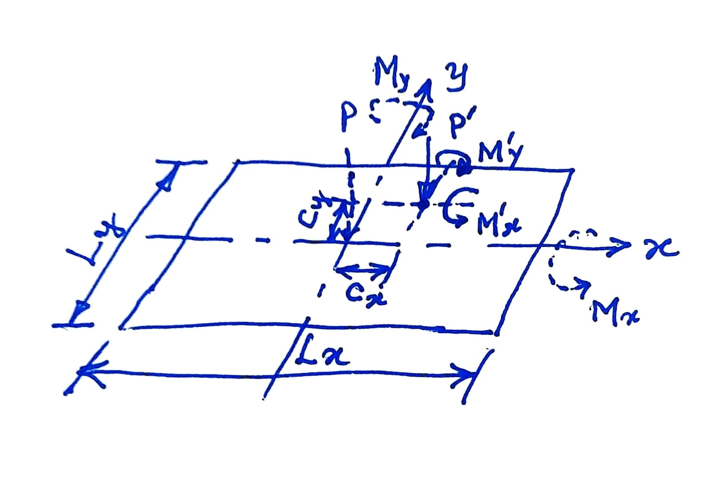

# Isolated Rectangular Footing

## Notations and Sign Conventions

The origin of the coordinate system is assumed to be at the geometric centre of the rectangular footing. Coordinate axes are positive as shown in the figure. $L_x$ and $L_y$ do not have sign associated with them. All other quantities are positive when they are as shown in the figure. Values opposite to those shown are taken to be negative.

| Quantity     | Description                       | Sign Convention |
|:-------------|:----------------------------------|:----------------|
|$L_x$, $L_y$  | Dimensions of footing along x- and y-axis, respectively | Not applicable |
|$c_x, c_y$    | Coordinates of column from the origin | Positive along positive direction of axes |
|$x, y$        | Coordinates of the point at which pressure is to be calculated | Positive along positive direction of axes |
|$P'$           | Axial load at the base of the column | Positive when acting downwards |
|$M'_x$         | Moment at the base of the column about the x-axis | Positive as per the Right Hand Rule |
|$M'_y$         | Moment at the base of the column about the y-axis | Positive as per the Right Hand Rule |

Equivalent axial load $P$ and moments $M_x, M_y$ about the x- and y-axes at he origin due to applied loads:

$$
\begin{align*}
    P &= P' \\
    M_x &= M'_x - P' \cdot c_y \\
    M_y &= M'_y + P' \cdot c_x
\end{align*}
$$

Pressure at $x, y$ due to $P, M_x$ and $M_y$:

$$
\begin{align*}
    p &= \frac{P}{L_x \cdot L_y} - \frac{M_x}{\frac{L_x \cdot L_y^3}{12}} \cdot y + \frac{M_y}{\frac{L_y \cdot L_x^3}{12}} \cdot x \\
    &= \frac{P}{L_x \cdot L_y} - \frac{12 \cdot M_x}{L_x \cdot L_y^3} \cdot y  + \frac{12 \cdot M_y}{L_y \cdot L_x^3 \cdot x }
\end{align*}
$$

Pressure at $x, y$ due to self weight of the footing depends on the thickness variation of the footing. For simplicity, let us assume the thickness to be uniform and equal to the equivalent thickness of the footing, that is, total self weight divide by the area of contact $L_x \cdot L_y$. Typically, the thickness is not known at the time of determining the plan dimensions of the footing and it is customary to assume the self weight to be a certain percentage of the column load. While this may work satisfactorily for concentrically loaded footings, it may not be true for eccentrically loaded footings.

In any case, it is a good idea to compute the actual self weight of the footing once the design is complete and check it against the initially assumed self weight. If the actual value turns out to be significantly different, either greater than or lesser than the assumed value, the footing may be redesigned with the assumed self weight equal to the actual self weight. After a few iterations, the design will converge to a satisfactory value of actual self weight compared the the self weight assumed at he start of the iteration.

The development of the application is available in [Session 11](../sessions/session11.md).